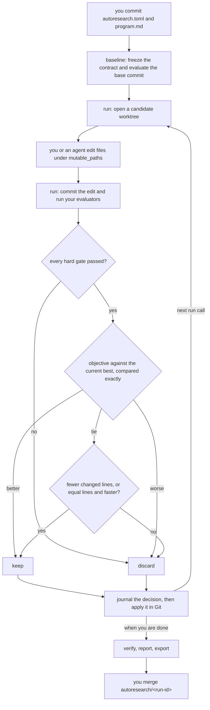

# autoresearch-rs

autoresearch-rs freezes an experiment contract, measures a baseline at an exact commit, and then advances one candidate per call: it commits one change in an isolated Git worktree, runs your evaluators on that commit, discards the candidate if any hard gate failed, keeps it if the objective beats the current best, settles an exact tie on the size of the diff, and journals the decision.

It is a pre-merge experiment runner for a number you already own, such as bundle bytes, open axe nodes or a rubric score. You get a reason code for every keep and discard, a local branch `autoresearch/<run-id>` that moves only when a candidate is kept, and a `verify` that reruns your evaluators at the kept commit before you merge that branch yourself. You write the evaluator that produces the number. It is not A/B testing on live traffic, and version 0.1.0 builds from source, with no prebuilt binaries and no registry release.

[](https://github.com/wolven-tech/autoresearch-rs/actions/workflows/ci.yml?query=branch%3Amain)
[](LICENSE)
[](rust-toolchain.toml)

Two rejected rows from a real ledger, from a UI loop on a Dioxus web app's timeline screen, where a weighted count over nine defect types read 29 at baseline:

```text
| 1 | Critical CSS/font plus contained timeline and content-crossing shimmer | 15 | Reject — Axe marked all 15 rail text nodes contrast-indeterminate. |
| 3 | Replace pseudo track with explicit aria-hidden timeline element | 10 | Reject — generic `li` rule made track sixth grid item and expanded desktop rail to 160.6px. |
```

Both candidates cut the count from 29, one to 15 and one to 10, and both were rejected because each left a named defect. Under autoresearch-rs, that defect becomes a hard gate, and a failed gate is read before the number.

autoresearch-rs is a Rust fork of Andrej Karpathy's [autoresearch](https://github.com/karpathy/autoresearch), and the upstream Python files are kept unmodified in [reference/python](reference/python/README.md). I'm Decebal Dobrica, and I maintain this fork at Wolven Tech. Those two rows, like every ledger row in this README, came from my own loops, run with the same contract by hand or by an agent following my autoresearch skill. None of them ran through this CLI, which was published on 2026-09-14 and automates the contract those loops followed.

Six of those loops have a recipe below, one per product surface, and each lane name links to it:

| Lane | Scalar | Better | Baseline | Best |
| --- | --- | --- | --- | --- |
| [WASM bundle](#bundle-bytes-wasm-size-while-adding-components) | release wasm bytes | lower | 510,535 B | 423,713 B |
| [Accessibility](#accessibility-axe-violations-plus-unresolved-contrast) | axe violations plus unresolved contrast | lower | 5 | 0 |
| [Integration contract](#integration-contract-behaviours-nobody-asserts) | unasserted behaviours | lower | 21 | 6 |
| [SEO](#seo-score-on-one-long-post) | `seo_score` on a local scorer | higher | 52.4 | 95.9 |
| [UI defects](#ui-defects-on-an-app-timeline-screen) | weighted defect count | lower | 29 | 0 |
| [Answer-engine readiness](#answer-engine-readiness-geo) | `retrieval_readiness_score` | higher | 5.00 | 100.00 |

To see whether it fits a number you own, read [recipes by product surface](#recipes-by-product-surface) and [what it does not prove or do](#what-it-does-not-prove-or-do). To set it up, start at [install and run one loop](#install-and-run-one-loop) and [the evaluator you still have to write](#the-evaluator-you-still-have-to-write). To hand it to Claude Code or Codex, go to [driving it from an agent](#driving-it-from-an-agent).

## A higher score discarded by the real CLI

The lanes in the table above, and their recipes further down, are hand-run. This one is not. The test `disposable_product_web_loop_keeps_improvement_discards_failed_gate_and_recovers` in [the CLI test suite](apps/autoresearch-cli/tests/cli.rs) drives the compiled `autoresearch` binary through init, baseline, run, resume, verify, report and export against a repository whose only mutable path is `site/index.html`. Its evaluator counts `<p>` elements and checks that the `Start` link survives. The count stands in for page quality and proves nothing about it, which is fine, because the decision is what is under test:

| Evaluation | Change to `site/index.html` | `fixture_content_items` | `cta_present` | Decision |
| --- | --- | --- | --- | --- |
| baseline | one paragraph and the Start link | 1 | ✅ | frozen |
| candidate 1 | adds a paragraph, keeps the link | 2 | ✅ | keep, `primary_improvement` |
| candidate 2 | adds a paragraph, drops the link | 3 | ⛔ | discard, `failed_hard_gates` |

Candidate 2 scored higher than the current best and was never compared on score. The test commits it by hand inside its worktree to simulate a crash after the commit, and `resume` evaluates it from there. The decision journaled for it serializes as:

```json
{"disposition":"discard","reason":{"reason":"failed_hard_gates","names":["cta_present"]}}
```

The test then asserts that `refs/heads/autoresearch/<run-id>` still points at candidate 1, that the next `run` stops with `candidate_limit`, that `verify` reruns the evaluator at the kept commit and reports `matched`, and that the caller's HEAD, page bytes and `git status` are unchanged.

## Who writes which file

The tool owns the loop. You own the definition of better, and you own the program that measures it.



| File or ref | Written by | What happens to it |
| --- | --- | --- |
| `autoresearch.toml` | you | frozen into the run at baseline, protected from candidates |
| `program.md` | you | frozen and protected; the brief for whoever makes candidates |
| `docs/BET.md` (optional) | you | frozen at baseline when present, but not auto-protected |
| your evaluator binary | you | runs on every evaluated commit and prints one JSONL line |
| files under `scope.mutable_paths` | you, or an agent | the only paths a candidate may change |
| `.autoresearch/` | the tool | run state, journal and worktrees; must be gitignored |
| `refs/heads/autoresearch/<run-id>` | the tool | moves only on keep and is never pushed |

The part nobody can skip is the evaluator. autoresearch-rs does not know what a bundle, an axe node or an SEO score is. It runs a program you point it at, hands that program one JSON request, and reads exactly one JSON line back. Only the evaluator's path is frozen, not its bytes, so pin the binary yourself; a rebuilt scorer halfway through a run changes the ruler without changing the identity.

## Install and run one loop

You need Rust 1.97.1 (pinned in [rust-toolchain.toml](rust-toolchain.toml)), `git` on your PATH with an author identity configured, because candidate commits are made with your normal Git config, and a product repository whose working tree is clean. Build the CLI from a checkout:

```bash
git clone https://github.com/wolven-tech/autoresearch-rs
# from the root of that checkout
cargo install --path apps/autoresearch-cli
autoresearch --version
autoresearch --repository /path/to/product init
```

Without installing, `cargo run -p autoresearch-cli -- --help` from the checkout prints the same subcommands.

`init` writes `autoresearch.toml` and `program.md` and never overwrites an existing file. The manifest it writes cannot run as it stands: its evaluator is `git diff --numstat`, which does not speak the JSONL protocol, so a baseline on the untouched template exits 5 and ends that run. `init` also leaves `.gitignore` alone, and `baseline` refuses with exit 4 until `.autoresearch/` is ignored.

Replace the template with a real contract. This one is a page-weight loop on a static site, and it runs only once `program` points at an evaluator you built that reports `page_renders`, `cta_present` and `page_bytes` (see [the evaluator you still have to write](#the-evaluator-you-still-have-to-write)). A missing evaluator shows up in `baseline` only as failure class `spawn` with the output withheld; `doctor`'s `evaluator_executable` line names the bad path. The evaluator path is absolute because evaluators start with an empty environment, with no PATH, no HOME and nothing else:

```toml
schema_version = 1

[experiment]
name = "landing page weight"

[experiment.objective]
name = "page_bytes"
direction = "minimize"

[experiment.budget]
max_candidates = 10
max_failures = 3
wall_clock_seconds = 3600

[scope]
mutable_paths = ["site"]
protected_paths = ["site/fixtures"]

[agent]
program = "manual"
timeout_seconds = 600

[[evaluators]]
id = "page_weight"
hard_gates = ["page_renders", "cta_present"]

[evaluators.command]
program = "/opt/autoresearch/bin/page-weight-evaluator"
args = ["--route", "/"]
timeout_seconds = 120

[[evaluators.metrics]]
name = "page_bytes"
kind = "objective"
direction = "minimize"

[authority]
allow = []
```

Every hard gate has to pass at baseline. Baseline capture records a failed gate without complaint, but every later decision then errors on the invalid baseline, so a run whose page is already blank at baseline can never decide anything. Because that candidate stays active, `stop` cannot end the run either, so start a new baseline. Fix the page first, or leave that gate out of this run.

Commit the contract and freeze it. The `baseline` output includes a `run: <run-id>` line and `next: run`; set that id, then open one candidate:

```bash
printf '.autoresearch/\n' >> /path/to/product/.gitignore
git -C /path/to/product add .gitignore autoresearch.toml program.md
git -C /path/to/product commit -m "chore: freeze autoresearch contract"
autoresearch --repository /path/to/product baseline
RUN_ID=run-1789415893414-28149-db7815db  # the value baseline printed after run:
autoresearch --repository /path/to/product run --run-id "$RUN_ID"
```

The first `run` prints `status: awaiting_mutation` and a `worktree:` line under `.autoresearch/worktrees/<run-id>/`. Edit files under `mutable_paths` in that worktree and leave the edits uncommitted. Then submit, check and package the result:

```bash
autoresearch --repository /path/to/product run --run-id "$RUN_ID" --hypothesis "inline the hero SVG" --json
autoresearch --repository /path/to/product status --run-id "$RUN_ID"
autoresearch --repository /path/to/product verify --run-id "$RUN_ID"
autoresearch --repository /path/to/product report --run-id "$RUN_ID" --html > /tmp/autoresearch-board.html
mkdir -p /tmp/autoresearch-review
autoresearch --repository /path/to/product export --run-id "$RUN_ID" --export-root /tmp/autoresearch-review
```

Each step says whether it worked. The submitting `run` commits your edits, evaluates, decides and finalizes; its JSON carries the decision, and `finalization.outcome` reads `kept` or `discarded` (without `--json` it prints only `status: evaluated`). `status` then prints `recovery: prepare_candidate`, and its `current commit` differs from the `base commit:` line that `baseline` printed only if something was kept (`status --json` shows both), in which case `git -C /path/to/product rev-parse autoresearch/$RUN_ID` prints the same commit. `verify` refuses until a candidate has been kept, then reruns the evaluators on it and exits 5 unless it prints `fresh verification: matched`.

`report` prints JSON by default and a script-free HTML board with `--html` (combining `--html` with `--json` exits 3). Redirect the board to a path outside the repository, because an untracked file in the checkout makes every later `--run-id` command refuse. `export` writes `report.json`, `report.html` and `provenance.json` into a new directory under an absolute root that must already exist outside the repository. To take a kept result, export or report first, then merge `autoresearch/<run-id>` yourself; merging moves your HEAD, and the run stops answering after that.

Two more commands exist for when things go sideways: `resume --run-id` performs exactly one recovery action from the journal, and `stop --run-id` records a cancellation between candidates. Exit codes are 0 for success, 2 for usage, 3 for config, 4 for environment and 5 for a failed evaluation or a verify that did not match.

`doctor` checks the repository, manifest and executables without running anything, with two gaps you should know before trusting it. It resolves bare program names against your PATH, which evaluators never get, and it treats `program = "manual"` as an executable to look up, so a manual-agent manifest reports not ready and exits 4.

## The evaluator you still have to write

Each evaluator receives one newline-terminated JSON request on stdin (run id, both commits, the candidate worktree path, changed paths and an artifact directory), and stdin is then closed. It must exit 0 and write exactly one line to stdout. This is the golden success response from the protocol tests:

```json
{"protocol_version":1,"result":{"status":"success","output":{"evaluator_id":"fixture","run_id":"run-1","baseline_commit":"0123456789abcdef0123456789abcdef01234567","evaluated_commit":"0123456789abcdef0123456789abcdef01234567","measurements":[{"kind":"hard_gate","name":"tests","outcome":{"passed":true,"detail":null}},{"kind":"numeric","name":"score","metric_kind":"objective","direction":"maximize","value":1.25}],"observations":[],"artifacts":[],"warnings":[]}}}
```

A failed gate is a measurement like any other. Next to a byte count, the blank page from the bundle lane below would be reported as:

```json
{"kind":"hard_gate","name":"page_renders","outcome":{"passed":false,"detail":"blank page"}}
```

The ids must echo the request, and `measurements` must contain every gate and metric the manifest declares for that evaluator, with the declared kind and direction, and nothing else. A measurement that could not be taken is reported as the whole line `{"protocol_version":1,"result":{"status":"failure","failure":{"class":"reported","detail":"..."}}}`, which is an evaluator failure rather than a failed gate. That distinction has teeth: a failed gate discards the candidate and the run moves on, while a failing evaluator exits 5, `resume` retries the same candidate, and `stop` refuses while that candidate is active.

The process runs with the candidate worktree as its working directory and zero environment variables, so every tool it calls needs an absolute path and every variable it needs (a `CARGO_TARGET_DIR`, a `CHROMIUM_PATH`) has to be set by the evaluator itself. It must also leave no file behind in the worktree, gitignored build output included, because cleanliness is rechecked after every evaluator. Point build output at the artifact directory from the request, which lives outside the worktree. That directory is shared by the baseline and every candidate, so key build output by `evaluated_commit` or accept a warm cache; `verify` gets a fresh subdirectory and builds cold. Stdout and stderr are capped at 1 MiB each. The full wire format is in [docs/evaluator-protocol.md](docs/evaluator-protocol.md), and [jsonl_evaluator.rs](crates/autoresearch-evaluator/examples/jsonl_evaluator.rs) is a Rust starting point tested against the golden records.

## Gates first, then an exact compare

Every candidate is compared with the current best, which is the baseline until something is kept and the most recently kept candidate after that. The order is fixed:

1. If the candidate fails any hard gate, it is discarded with `failed_hard_gates`, and the objective is never read.
2. The objective values are compared exactly, with no epsilon and no noise tolerance. A strict improvement keeps (`primary_improvement`) and a regression discards (`primary_regression`).
3. On an exact tie, the candidate's changed line count decides, then evaluator runtime. Fewer keeps, more discards, and equal on both discards with `no_improvement`.
4. The decision is journaled before Git is touched, so `resume` can apply a recorded decision without scoring again.

Ties against the baseline always discard, because the baseline's complexity is recorded as zero, so no loop can "improve" a page against its baseline by moving whitespace. A tie against a kept candidate is narrower: it survives if it changed fewer lines than that candidate, or failing that ran faster. The runtime step compares wall-clock milliseconds, so an equal-lines tie against a kept candidate is effectively a coin toss. Metrics declared as `tie_breaker` or `diagnostic` in the manifest are recorded and never read by selection.

Exact comparison is a choice with a cost. It is right for byte counts, node counts and weighted defect counts, which do not move between two runs of the same commit. It is wrong for anything that jitters, like a single Lighthouse sample or a wall-clock timing, where noise will be kept as a win and `verify` will report `drifted`. There are no repeats either. Characterise the noise first (hyperfine does that for timings), then have the evaluator emit a statistic stable enough to compare exactly; folding five noisy samples into a mean that still wobbles only moves the coin toss to `verify`.

Two things in the manifest look like controls and are not enforced by the CLI. `max_candidates` stops the run with `candidate_limit`, but `max_failures` and `wall_clock_seconds` are validated and then ignored on this path. The `--hypothesis` text is required to submit a manual candidate and is then thrown away: it is not written to the journal or the report, and candidate commits carry a fixed message. If the reason for a change matters, and it does, write it down yourself.

## What a run does to your repository

`run` never edits your checked-out files, but it does change the repository around them. Before baseline, `autoresearch.toml`, `program.md`, `.gitignore` with `.autoresearch/` in it, and every other pending change must be committed. `baseline` checks only the frozen inputs before it creates the run, so a stray untracked file leaves a pending run that `resume --run-id` can finish once the tree is clean. From baseline until you are done with the run, the whole working tree must stay clean, untracked files included, or every `--run-id` command refuses on a dirty repository. Your HEAD must stay on the frozen base commit too; if it moves, even `status`, `report` and `verify` fail with "caller HEAD differs from frozen base commit". Put the run in its own clone if you need to keep working.

- Baseline creates the local branch ref `refs/heads/autoresearch/<run-id>` at the base commit. It moves only on keep, via a compare-and-swap `git update-ref`, and nothing is pushed.
- Every candidate, baseline and verification gets a locked detached worktree under `.autoresearch/worktrees/<run-id>/`. Candidate worktrees are removed after finalization; baseline and verification worktrees are left locked, so remove them with `git worktree unlock <path>` and then `git worktree remove <path>`.
- Candidate commits are made without hooks, in the candidate worktree, from its parent. Discarded commits stay behind as unreferenced objects.
- A candidate is refused if it touches a path outside `mutable_paths`, a protected path, a symlink or a submodule, or if it leaves ignored untracked files.
- A candidate that changes `Cargo.toml`, `Cargo.lock`, `package.json`, a lockfile, `pyproject.toml`, `go.mod` or any binary file cannot be decided: complexity measurement errors after the evaluators have already run. That rules out "strip dependencies" loops for now.
- Each command holds the lock file `.autoresearch/run.lock` while it works, so two commands never operate on the repository at once.

## Recipes by product surface

Each recipe is one of my loops, laid out as the pieces you would copy: the frozen corpus, the scalar, the gate, the real ledger rows, and the line between what autoresearch-rs covers today and what you write. The bundle recipe also writes its contract as a manifest fragment that replaces `[experiment.objective]`, `[scope]` and the evaluator tables in the full manifest above. Its paths, gate identifiers and evaluator name are invented for illustration; the corpus, the gate conditions and the numbers come from the ledger, and the other recipes translate the same way.

### Bundle bytes: WASM size while adding components

The corpus was a component audit of one real marketing page: nav with call-to-action, hero with dual actions, three-column numbered feature grid, numbered process steps, itemised cost breakdown, one-off pricing block, FAQ and multi-column footer. The scalar was the `apps/web` release wasm in bytes, lower is better. The gate was cargo build, test, clippy `-D warnings`, fmt, `cargo audit --deny warnings`, the wasm32-unknown-unknown cross-compile, and `apps/web` still compiling as the coverage fixture. A rendered visual check joined the gate after a blank page passed every command.

```toml
[experiment.objective]
name = "web_wasm_bytes"
direction = "minimize"

[scope]
mutable_paths = ["crates/components/src", "apps/web/src"]

[[evaluators]]
id = "wasm_bundle"
hard_gates = ["cargo_build", "cargo_test", "cargo_clippy", "cargo_fmt", "cargo_audit", "wasm32_cross_compile", "web_app_compiles", "page_renders"]

[evaluators.command]
program = "/opt/autoresearch/bin/wasm-bytes-evaluator"
timeout_seconds = 290

[[evaluators.metrics]]
name = "web_wasm_bytes"
kind = "objective"
direction = "minimize"
```

Baseline `510,535 B`, best `423,713 B`. The ledger's net line and its only discard:

```text
−86,822 B (−17.0%) against baseline, while adding 20 components.

| 5 | `opt-level = "z"` in `[profile.release]` | 490,481 B | 0 | **Discard** — byte-identical, because `dx` builds the bundle with its own `wasm-release` profile. Everything tuned in `[profile.release]` was reaching the server binary and never the browser. |
```

`opt-level = "z"` moved the browser bundle by nothing. Two defects passed every command. The Tailwind stylesheet shipped as 23 bytes (fixed in row 2, which moved the scalar by 0 bytes), and a blank page threw an `atob` error (fixed in row 7, which was also the largest single drop: `−59,956 B` against row 6). "Compiles" was not "renders". The loop stopped on effort budget, and its 2-consecutive-discard stop never tripped.

Two of those rows would behave differently under autoresearch-rs today. Row 2's fix moved the objective by 0 bytes, which is a tie, and a tie is discarded unless it changed fewer lines than the current best or, on equal lines, ran faster, so a real fix the number cannot see belongs in a gate. Row 5 changed `[profile.release]`, which normally lives in `Cargo.toml`, and a candidate touching `Cargo.toml` cannot be decided by the CLI today.

The cargo hard-gate adapter in `autoresearch-evaluator` knows fmt, clippy, test and build, but it is a library API that no manifest can select, and it expects `CARGO_NET_OFFLINE` and `CARGO_TARGET_DIR` in a declared environment the CLI never passes. Through the CLI, your JSONL evaluator runs those gates itself, reports each one as a hard gate, and prints the byte count. The [performance pack](examples/portfolio/performance/autoresearch.toml) is a template whose evaluator placeholder must be replaced. Source ledger: [component-kit-autoresearch.md](https://github.com/wolven-tech/rust-v2/blob/main/docs/ledger/component-kit-autoresearch.md).

### Accessibility: axe violations plus unresolved contrast

The corpus was the `/motion` page served by `apps/web`, at 1280×900, plus its `prefers-reduced-motion: reduce` state. The scalar was violation nodes plus unresolved color-contrast nodes, as reported by axe-core 4.10.2 under `wcag2a`, `wcag2aa`, `wcag21a` and `wcag21aa`, lower is better. The gate: `cargo xtask ci` green, all seven components present and interactive, no component deleted, every infinite animation covered by `prefers-reduced-motion`, no unsubstituted template placeholder in rendered text (added mid-loop), and a screenshot that looks right.

| Row | Scalar | What it counted |
| --- | --- | --- |
| baseline | 5 | one `html-has-lang` violation, four unresolved contrast nodes |
| best | 0 | nothing open under the four tag sets |

The first version of the scalar counted violations alone and read 1, which looked almost compliant. Counting axe "incomplete" nodes as open questions gave the real 5. Row 1b was a regression the gate missed: the `{script_include}` placeholder rendered as literal text at the bottom of every page, it was caught only by a screenshot, and the gate was strengthened. A zero here is not WCAG AA conformance.

The product-web browser adapter samples bounded keyboard traversal and solid-colour contrast in local Chromium, but it does not run axe-core, it emits hard gates only, and it needs `CHROMIUM_PATH` in a declared environment the CLI never passes, so through the CLI it reports "Chromium path unavailable". A numeric axe count is your own JSONL evaluator, which launches the browser by absolute path. The "looks right in a screenshot" gate has no slot in the protocol unless your evaluator can compute it, so keep that read human. Source ledger: [motion-aa.md](https://github.com/wolven-tech/rust-v2/blob/main/docs/ledger/motion-aa.md).

### Integration contract: behaviours nobody asserts

The corpus was 21 behaviours of the AllSource Core integration. The scalar was corpus behaviours with no direct automated assertion against a live Core, lower is better. The gate was cargo build, test, clippy `-D warnings`, fmt `--check`, `cargo deny check`, `cargo machete`, the wasm32 cross-compile, and all three vertical-slice tests against a live Core.

The ledger's net line:

```text
21 → 6 unasserted (−71%). 13 contract tests, all running in CI.
```

The gate rejected proposal 3's first draft, and that rejection was the finding. The draft asserted that Core normalizes a PascalCase event type, and it failed with `append failed: 400`. Normalization is client-side only: the belief was wrong, not the code. A newly discovered protective behaviour was deliberately left out of the corpus mid-loop, because adding it would have let the loop change its own denominator. Under autoresearch-rs, that corpus file belongs in `protected_paths`, carved out of the mutable root.

autoresearch-rs covers keeping the corpus out of reach of candidates (`protected_paths`), the isolated worktree per candidate and the gate-first decision. The cargo gate list and the count are your JSONL evaluator, for the same empty-environment reason as the bundle recipe. If your Core runs off the machine, `requires_network = true` also needs `network` in `authority.allow`, that declaration isolates nothing, and such a manifest can only run in manual mode. Source ledger: [allsource-integration-corpus.md](https://github.com/wolven-tech/rust-v2/blob/main/docs/ledger/allsource-integration-corpus.md).

### SEO score on one long post

The corpus was one newsletter post, Rust AI Weekly #12, scored by a read-only local script. The scalar was `seo_score`, 0 to 100, higher is better. The gate: no change to slug, filename, or any fact, number, verdict, name or date; series format and no em dashes preserved; keyword density capped at 2%; a change that improves the score but reads like SEO copy is a discard; no app code touched inside the loop; a human reads the diff before push; a budget of 20 experiments or 5 without movement.

Baseline `52.4` (4079 words), best `95.9` (4086 words), on the local scorer only. Three of the discards:

```text
f841cd7	95.9	4086	discard	add "gpu" tag
1f694e0	88.0	4086	discard	longer seoTitle naming all three hooks
b488d29	86.1	4086	discard	shorter seoDescription variant (control)
```

Every discard also tied or lost on score, so the score alone rejected each one. The "gpu" tag tied at 95.9, and a tie is a discard in that ledger. Under the CLI the same tie would be settled on changed lines against the kept 95.9 candidate, and a one-line tag could win it, so if a tag is not worth keeping, say so in a gate. Checks the series format fails by design (average sentence 30.5 words) were left failing on purpose and written down. This is a local scorer, and it proves no ranking.

The [SEO pack](examples/portfolio/seo/autoresearch.toml) is a template, and the product-web SEO checks produce diagnostics and artifacts, not a number. A numeric score needs a JSONL wrapper around your scorer. The "reads like SEO copy" gate and the human read of the diff stay with you; nothing leaves the `autoresearch/<run-id>` ref until you merge it.

### UI defects on an app timeline screen

The corpus was a Dioxus web app's root at 1440×900, 390×844 and 320×844, with four stage jumps, first-load resource order, scroll, text spacing, keyboard focus and reduced motion. The scalar was a weighted defect count, lower is better:

| Defect | Weight |
| --- | --- |
| stylesheet discovered behind WASM | 8 |
| product font not preloaded | 3 |
| sticky backdrop-filter compositor risk | 5 |
| rail/header container misalignment | 4 |
| floating connector dots | 4 |
| no selected-stage state | 3 |
| hover position movement | 2 |
| each unresolved Axe contrast node | 1 |
| rail height above 100px | 10 |

Baseline 29, best 0. The opening rows of this README, in their ledger:

```text
| 1 | Critical CSS/font plus contained timeline and content-crossing shimmer | 15 | Reject — Axe marked all 15 rail text nodes contrast-indeterminate. |
| 3 | Replace pseudo track with explicit aria-hidden timeline element | 10 | Reject — generic `li` rule made track sixth grid item and expanded desktop rail to 160.6px. |
```

Three candidates improved the scalar (15, 15, 10) and were still rejected, and each rejection names the defect that was left. Only row 4, at 0, was kept. After it, browser resource entries started the font at 34.0ms and CSS at 34.1ms, before WASM at 37.4ms and first paint at 56ms.

In autoresearch-rs terms each of those rejections is a better-scoring candidate lost to a failed hard gate, so the contrast and rail-height defects belong in named hard gates, not only in the weights. The [ui pack](examples/portfolio/ui/autoresearch.toml) is a template, and the product-web route and accessibility checks supply hard gates as library code. The weighted count is your JSONL evaluator.

### Answer-engine readiness (GEO)

This loop ran on ChargeWindow, my own product. The scalar was `retrieval_readiness_score`, higher is better, and `geo_readiness_score` stayed at 100.00 on every row as a regression gate. At baseline, production already returned HTTP 200 to both Perplexity agents, but the source lacked explicit access, canonical-domain corpus alignment, namesake disambiguation and active discovery submission.

| Row | retrieval_readiness_score |
| --- | --- |
| baseline | 5.00 |
| crawler-access | 18.00 |
| canonical-domain | 28.00 |
| entity-resolution | 83.00 |
| sitemap-freshness | 88.00 |
| answer-corpus | 93.00 |
| discovery-path | 100.00 |

The production IndexNow row is logged `submitted`, not `keep`, with the note `acceptance does not prove indexing or Perplexity inclusion`. Entity resolution was the largest step, and that size comes from the evaluator's own weights, not from observed retrieval: crawler-access was 13 of 100 points, and entity-resolution was 55 points across five checks. I could not tell readiness work apart from actual citations. The score measures readiness, and it says nothing about indexing, ranking or citations.

The [geo pack](examples/portfolio/geo/autoresearch.toml) and the product-web entity, passage and source-coverage diagnostics cover the local lint; linked sources are not fetched. A 100-point regression gate becomes a boolean hard gate your evaluator computes. The product-web production probes cannot be enabled through the CLI. Nothing stops your own evaluator from reaching production, so keep production calls out of it yourself.

### Other surfaces the contract has run on

The same contract has also run on conversion rubrics on application pages, read-only go/no-go research screens that were allowed to say no, first-paint and TTFB budgets, and a correctness-first then runtime loop on a number parser.

## What it does not prove or do

An accessibility number from these loops, or from the product-web adapter, is not WCAG AA conformance: the adapter's keyboard traversal checks at most eight controls, and its contrast sampling handles only simple opaque colours. SEO and GEO results are local lint and local scorers, and no rankings or AI citations are proven by them. Lab scores do not prove customer demand, and nothing in a run moves a product bet gate or counts as promotion evidence. If the question needs live users, an A/B platform answers it and this cannot.

The [tiny Candle example](examples/nanochat-candle/README.md) runs a bounded CPU/f32 training experiment; it is not nanochat, CUDA or H100 training parity, and [docs/training-parity.md](docs/training-parity.md) records where it differs. There is no OS-level network isolation or sandbox for evaluator or agent processes, and descendant processes are not cleaned up. `requires_network` and `[authority]` are declarations that never grant anything, so run untrusted evaluators and agents inside a sandbox you supply.

autoresearch-rs does not deploy or publish anything. A keep moves a local ref, and `export` writes a redacted bundle to a directory you chose, where the redaction is a bounded defence and not proof that no secret remains ([docs/evidence-board.md](docs/evidence-board.md)). It is not autonomous orchestration either: each `run` call advances one candidate, and nothing schedules the next call for you.

## Driving it from an agent

The simplest agent setup is manual mode: point Claude Code, Codex or a person at the worktree that `run` printed, let it edit only the mutable paths, and submit with `--hypothesis`. A candidate that edits `autoresearch.toml` or `program.md` is refused, because both are always protected.

### The Claude skill

[skills/autoresearch](skills/autoresearch/SKILL.md) teaches a Claude agent to run this loop through the CLI: the contract, a JSONL evaluator, one hypothesis per candidate, verify, report, and a write-up committed only after the run ends. Its [manifest and evaluator reference](skills/autoresearch/references/manifest.md) and its [statistical guards](skills/autoresearch/references/guards.md) follow the code where the code and `docs/` disagree, which is the same rule this README follows. Link the directory into your skills folder:

```bash
ln -s /absolute/path/to/autoresearch-rs/skills/autoresearch ~/.claude/skills/autoresearch
```

The skill gives the agent the procedure, not the judgement. The objective, the gates and the evaluator are still yours to write, and a skill cannot make an evaluator honest.

### Command mode

Command mode runs the agent inside the same call:

```bash
autoresearch --repository /path/to/product run --run-id "$RUN_ID" --mode command --hypothesis "drop the unused icon font" --allow-executable /opt/agents/candidate-agent
```

It needs `--hypothesis`, an absolute `agent.program` that canonicalizes to the same file as `--allow-executable`, and an empty `authority.allow`. The agent receives a JSON `MutationRequest` on stdin, runs with its environment cleared except `LANG=C` and `TZ=UTC`, has its stdout and stderr discarded apart from byte counts, and must exit 0 with its edits left uncommitted. A command-mode agent therefore gets no credentials, no HOME and no PATH, so a hosted model CLI needs a wrapper binary that sets them, and a manifest that declares network authority cannot use command mode at all. The fragments in [examples/agents](examples/agents/README.md) show the process contract only.

## Status

The workspace is at version 0.1.0, with no Git tags yet. CI runs on every push and pull request: `cargo fmt --all --check`, `cargo clippy --workspace --all-targets --all-features -- -D warnings`, a Chromium launch check, `cargo test --workspace --all-features --no-fail-fast`, and `cargo doc --workspace --all-features --no-deps` with `RUSTDOCFLAGS=-D warnings`. Run the four cargo commands before you send a change. Six of the browser tests in `crates/autoresearch-product-web/tests/browser.rs` return without asserting anything when they find no Chromium, so set `CHROMIUM_PATH` or put `chromium` on PATH before trusting a green run of the product-web crate. On Ubuntu 24.04, Chromium's sandbox also needs unprivileged user namespaces, which [the CI workflow](.github/workflows/ci.yml) grants to the Chromium binary alone through an AppArmor profile.

## Where this came from

The loop of modify, measure, keep or discard, and the `program.md` contract, come from Andrej Karpathy's [karpathy/autoresearch](https://github.com/karpathy/autoresearch). This repository ports that idea to Rust and hardens it with frozen inputs and Git isolation. The upstream Python files are preserved in [reference/python](reference/python/README.md), with the pinned upstream commit and blob IDs in [reference/python/MANIFEST.md](reference/python/MANIFEST.md).

I announced the fork on [LinkedIn](https://www.linkedin.com/feed/update/urn:li:activity:7505300232457539584/) and [X](https://x.com/ddonprogramming/status/2099564536881647944) on 2026-09-14. How this README was rewritten and scored is recorded in [its ledger](docs/ledger/readme-autoresearch.md).

## License

Everything in this repository except the ten upstream files in `reference/python` is under the MIT license in [LICENSE](LICENSE), which matches the `license` field in the Cargo manifests. Upstream has no license file of its own, and its README ends with a License section reading "MIT"; [NOTICE](NOTICE) records that boundary, and this repository grants no new rights to those files.
